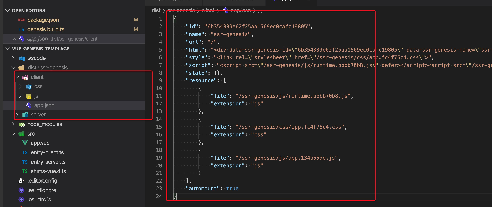

## Based on Vue CSR micro frontend implementation plan
I will not talk about the advantages and disadvantages of the micro frontend here. I assume that you are responsible for the development of a mid- and back-end management system. All business modules are packaged in a project. As the business volume continues to grow, the compilation is getting more and more. Slow, you expect to be able to independently develop and deploy new businesses from old projects, and embed them into old projects in the form of micro-applications.

The audience of this article is those who want to embed micro applications in new and old projects without requiring you to modify the old project. If this article is helpful to you, please click 👍!


## The main elements
- Build production environment code and output JSON required by remote components
- Through ajax request, get this JSON data and pass it to the remote component

## New project construction
For the construction of the project, I will not elaborate on it here. Let’s look directly at [Genesis](https://fmfe.github.io/genesis-docs/guide/#%E5%AE%89%E8%A3%85) The document to start the project quickly

## Modify compiled code
```ts
import path from 'path';
import fs from 'fs';
import { Build } from '@fmfe/genesis-compiler';
import { ssr } from './genesis';

const start = async () => {
    /**
     * Create a compiled instance
     */
    const build = new Build(ssr);
    /**
     * Start executing the compiler and build the production environment application package
     */
    await build.start();
    /**
     * After the compilation is complete, create a renderer that outputs the content required by the remote component
     */
    const renderer = ssr.createRenderer();
    /**
     * CSR rendering output JSON
     */
    const result = await renderer.render({ mode: 'csr-json' });
    /**
     * Save JSON to client directory
     */
    fs.writeFileSync(
        path.resolve(ssr.outputDirInClient, 'app.json'),
        JSON.stringify(result.data, null, 4),
        'utf8'
    );
};
start();

```
If you follow the official documentation, you only need to modify the `genesis.build.ts` file yourself. If you have customized the file name, just create a renderer after the execution of the `await build.start()` method, and save the CSR rendering result to a JSON file.

After the compilation is complete, you will get such a file

You only need to deploy the static files in the `client` directory to your server.


## Old project remote component loading
Assuming that the basic path of your static resource is `/ssr-genesis/`, then you can access this file through `/ssr-genesis/app.json`.

Install remote components on your old project
```bash
npm install @fmfe/genesis-remote axios
```
Use the remote component on your corresponding route and load this component.
```vue
<template>
    <div class="app">
        <RemoteView :fetch="fetch" />
    </div>
</template>
<script lang="ts">
import Vue from 'vue';
import axios from 'axios';
import { RemoteView } from '@fmfe/genesis-remote';

export default Vue.extend({
    components: {
        RemoteView
    },
    methods: {
        async fetch() {
            const res = await axios.get('/ssr-genesis/app.json');
            if (res.status === 200) {
                return res.data;
            }
            return null;
        }
    }
});
</script>
```

## Multi-history mode support
If you use historical mode in your old project and also use historical mode in the sub-application, it will cause `router.push('/xxx')` to generate multiple historical records. To solve this problem, you can use the `abstract` mode in the sub-application , Or use [@fmfe/genesis-app](http://localhost:8080/genesis-docs/app/#%E5%AE%89%E8%A3%85) to help you handle multiple Router instances using history mode BUG generated, please note that you need to use [@fmfe/genesis-app](http://localhost:8080/genesis-docs/app/#%E5%AE%89%E8%A3%85 ) Router after packaging

## Expand
```ts
/**
 * CSR rendering output HTML
 */
const result = await renderer.render({ mode: 'csr-html' });
/**
 * Save html to client directory
 */
fs.writeFileSync(
    path.resolve(ssr.outputDirInClient, 'index.html'),
    result.data
    'utf8'
);
```
If you just want to do a CSR project, you only need to render html. Just like the normal CSR project, deploy the `client` directory to the server.


## Summarize
[Genesis](https://github.com/fmfe/genesis) is just a Vue SSR rendering library, it is not a framework, it just provides you with the most basic SSR rendering capabilities.