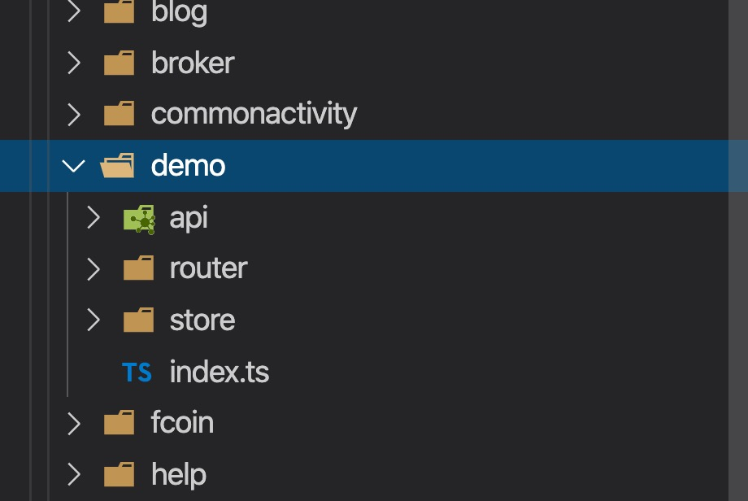
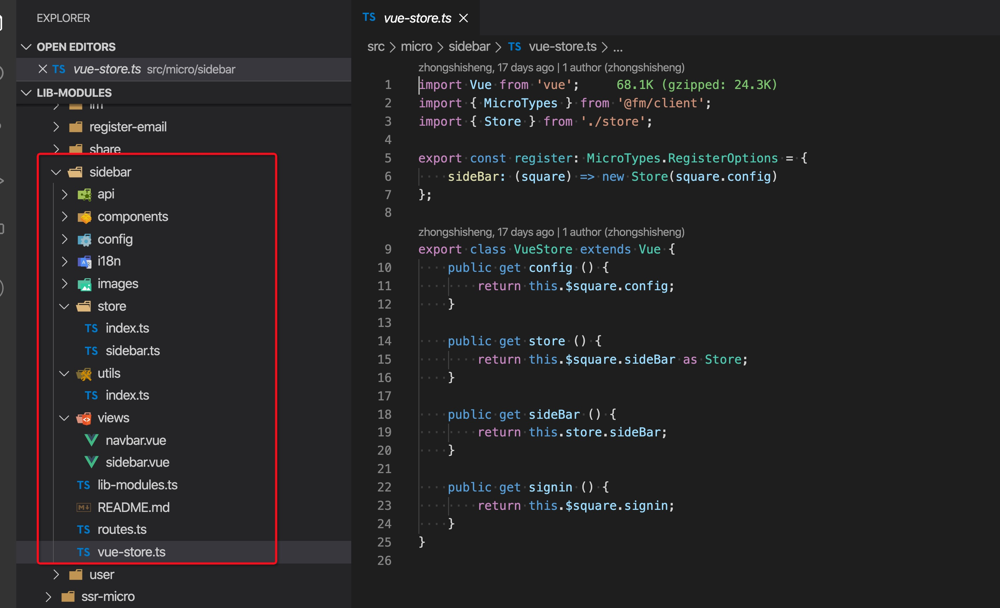
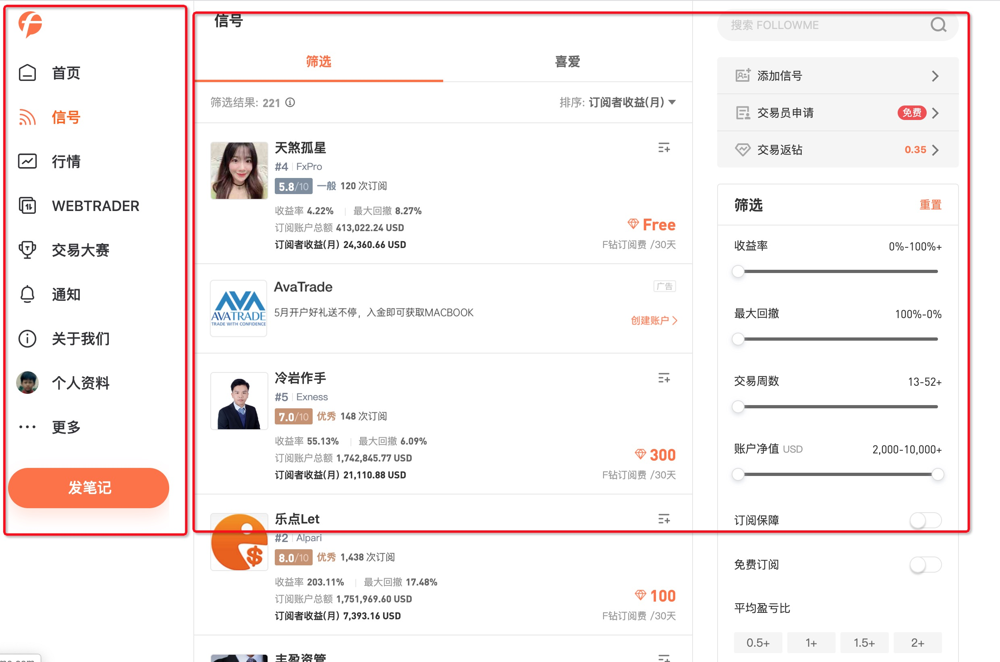

# Vue SSR-based micro-architecture practice in FOLLOWME5.0
The first version of [FOLLOWME5.0](https://www.followme.com/c/21009745?source=genesis) was finally launched on May 22, 2020, which is also the first in the company based on `Genesis` Two projects. The home page is the oldest kind of Vue SSR experienced by the old project. Later, at the beginning of the year, it was migrated to Nuxt.js, and now it is migrated to `Genesis`, which is a twist.

## First practice

In the first half of 2019, we implemented modularization for the first time in a project co-developed with APP. It has independent API, routing, status, and pages, and is initialized on demand, but it is not perfect. , It is a routing-based micro-module, and the state is also injected into the global state management as needed
## No routing micromodule
In August 2019, I began to intervene in the development of the web homepage. The first thing I faced was the state management based on Vuex. All the states were injected into the global state and intersected together. With the iteration of the business, they have been divided. Know which ones are needed and which can be deleted. With the expansion of the business scale, it becomes more and more difficult to maintain. In order to ensure no intrusion, based on [Tms.js](https://www.npmjs.com/package/tms.js), a state library supporting micro-modules was abstracted. At this time, our micro-modules have independent API, status and page.


Our 5.0 left navigation was pulled out into an independent running micro-module, a micro-module is composed of multiple components, it has its own internal state management.

## Great Leap Forward
At the end of 2019, when we learned that we want to upgrade version 5.0, the website will also be refactored significantly. Based on the existing micromodule development concept, we hope to be able to take a step closer and solve some of the previous project architecture. Disadvantages.   

Before 5.0, we have a common navigation bar, whether it is a CSR or SSR project, it needs it. Every time the navigation bar changes, we need to repackage a dozen projects for release, which greatly consumes our body and mind Physically, I hope that a page can be aggregated from different SSR services and provided to another service through the API.

After the birth of this bold idea, we studied Nuxt.js in depth, hoping that it could meet our needs. After some research and confirmation that it could not meet my needs, we finally chose to build wheels.

## Genesis
With reference to the implementation of some community SSR frameworks, they are basically packaged frameworks with low flexibility, and we expect it to be a simple SSR library, used as a tool function, in order to support multi-instance operation.

Under the concept here, it does not directly read a configuration like Nuxt.js `nuxt.config.js` and start to run, giving you a variety of integrated functions, it is only a basic to no basic rendering tool function

```ts
import { SSR } from '@fmfe/genesis-core';

const ssr = new SSR();

const renderer = ssr.createRenderer();

renderer.render({ url: '/' });

```
Of course, in actual business, we also need to create an HTTP service to return our content to the user.
    
    
If you want to achieve microservices and can be called between different services, you first need the service's own ability to output the rendering result `JSON`, and then the third-party service reads the rendering result and outputs it to HTML
```ts
renderer.render({ url: '/', mode: 'ssr-json' });
```
We skillfully used Vue's `Renderer` option [template](https://ssr.vuejs.org/zh/api/#template), passed in a function, and returned a JSON rendering result after execution
```ts
const template: any = async (
    strHtml: string,
    ctx: Genesis.RenderContext
): Promise<Genesis.RenderData> => {
    const html = strHtml.replace(
        /^(<[A-z]([A-z]|[0-9])+)/,
        `$1 ${this._createRootNodeAttr(ctx)}`
    );
    const vueCtx: any = ctx;
    const resource = vueCtx.getPreloadFiles().map(
        (item): Genesis.RenderContextResource => {
            return {
                file: `${this.ssr.publicPath}${item.file}`,
                extension: item.extension
            };
        }
    );
    const { data } = ctx;
    if (html === '<!---->') {
        data.html += `<div ${this._createRootNodeAttr(ctx)}></div>`;
    } else {
        data.html += html;
    }
    data.script += vueCtx.renderScripts();
    data.style += vueCtx.renderStyles();
    data.resource = [...data.resource, ...resource];
    (ctx as any)._subs.forEach((fn: Function) => fn(ctx));
    (ctx as any)._subs = [];
    return ctx.data;
};
```

## Remote component
Considering that not all projects require remote invocation, so remote invocation components are provided in separate packages. After getting the rendering result of SSR JSON, the remote component will help us to embed it in the page of the service.
```vue
<template>
    <remote-view :fetch="fetch" />
</template>
```
`fetch` is an asynchronous callback function. You can use the axios library to send a request to return the result of SSR rendering to the `remote-view` component.
```ts
renderer.render({ url: '/', mode: 'ssr-json' }).then((r) => {
    // Write an interface to provide r.data to remote-view component for access
});
```

## 5.0 Service Split

According to the UI rendering effect, we split the left navigation and content area into different services. Among them, the content area is divided into different services because of different development teams and different businesses.
In the first version, we split the `node-ssr-general` service of the left navigation, the `node-ssr-home` service of the homepage and notification, and the `node-ssr-signal` service of the signal, each of which is Independent deployment, independent development, and maintenance by different people, but eventually aggregated by the `node-ssr-general` service.

In the future, our products will be further iterated, and more and more services will be integrated into this large application.

## Intranet domain name
In the initial SSR service, I tried to use RPC and HTTP to obtain interface data for rendering. After weighing, we uniformly adopted the method of configuring HOST on the server in 5.0, configuring an intranet domain name, and providing the SSR service with HTTP requests. retrieve data

## Service loading strategy
In order to present the first screen to the user faster, the remote component on the server side uses SSR rendering. When the client route is switched, the CSR rendering is used. Therefore, when the `Home` switch to the `Signal` section, it will There are some obvious white screens during the loading process.

You can use Service Worker to preload static resources of all services and HTML during CSR rendering to reduce the chance of a white screen when loading the service content

## About Micro FrontEnd
In theory, `Genesis` can also support React at the same time, output the same standard JSON rendering results, and the same standard application creation and destruction logic. However, at present, our team is mainly based on Vue, so this aspect needs the team to have time to support.

## Portal
[](https://www.followme.com/signal/?source=genesis)
- [FOLLOWME5.0](https://www.followme.com/c/21009745?source=genesis) New version of strategy experience
- [Genesis](https://github.com/fmfe/genesis) Github
- [Genesis](https://fmfe.github.io/genesis-docs/) documentation
- [vue demo](https://github.com/lzxb/vue2-demo) SSR demo based on Genesis + TS + Vuex
- [Microarchitecture demo](https://github.com/fmfe/vue-genesis-micro) Example of micro frontend & micro service based on Vue SSR for Genesis framework
- [Article Source Address](https://fmfe.github.io/genesis-docs/blog/followme5.0.html)