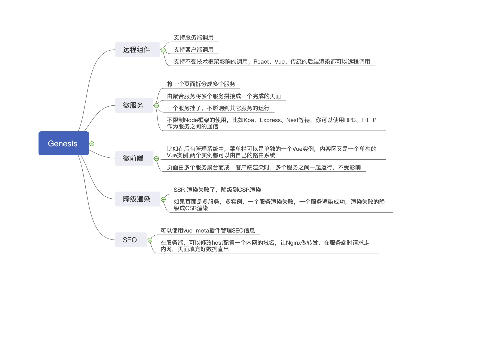

# Introduction

## Project origin
At the end of 2019, I learned that the company is going to launch a [Followme5.0](https://www.followme.com?source=genesis) version, which will greatly rebuild the entire web-side product, so This project also began to emerge. At that time, the homepage of the website used [Nuxt](https://github.com/nuxt/nuxt.js) as the framework of SSR, but it could not meet some of our needs. I also tried to write [Nuxt](https://github.com/nuxt/nuxt.js) plug-in to achieve our needs, but in the end it can not be achieved, and we can only start anew.

## Why not continue to use Nuxt?
[Followme](https://www.followme.com?source=genesis) is an extremely complex website. Our technology stack includes SSR and CSR. When updating public components, we often need to update more than a dozen projects at the same time. , And the compilation of the front-end project is particularly slow, even if it is a copy change, it needs to be released for most of the day. The architecture of [Nuxt](https://github.com/nuxt/nuxt.js) is a single application, which cannot support multiple application instances on one page at the same time, and SSR microservices. With the concept of microservices in mind, we began to think about how to redesign the architecture we need.

## Our needs

We need `remote components`, `microservices`, `micro frontends`, `degraded rendering`, `SEO`, after some technical research, including [Nuxt](https://github.com/nuxt/nuxt.js), and finally chose to make their own wheels.

## Architecture
|Core library|Version number|Downloads|Description|
|:-|:-:|:-|:-|
|[@fmfe/genesis-core](https://fmfe.github.io/genesis-docs/core/)| | |Provide basic plug-in mechanism, SSR rendering logic, program configuration|
|[@fmfe/genesis-compiler](https://fmfe.github.io/genesis-docs/compiler/)| ||Only used in the development environment, responsible for compiling programs and compiling at development time, processing the core logic of webpack |
|[@fmfe/genesis-app](https://fmfe.github.io/genesis-docs/app/)| | |Quickly create an application, wrap the vue-router, and support multiple Router instances in micro front-end applications Is particularly useful |
|[@fmfe/genesis-remote](https://fmfe.github.io/genesis-docs/remote/)| ||Remote components to achieve the core dependencies of the micro frontend|
|[@fmfe/genesis-lint](https://www.npmjs.com/package/@fmfe/genesis-lint)| | |A code specification integration, including eslint and stylelint|

[Nuxt](https://github.com/nuxt/nuxt.js) integrates webpack, babel and other development dependencies into one package, so it needs to be installed when releasing the production environment Dependency is particularly large, resulting in a particularly large image built by docker. Therefore, when designing `Genesis`, the functions used in production and development are split into `@fmfe/genesis-core` and `@fmfe/genesis-compiler`, so that in the production environment, only installation is required` @fmfe/genesis-core`, just compare [Nuxt](https://github.com/nuxt/nuxt.js) will greatly reduce the size of the docker image

### Small project
If your project is relatively simple, you don't need to consider `microservices`, `micro frontend`, just use `@fmfe/genesis-core` and `@fmfe/genesis-compiler`.

### Big project
If your project is more complex, you need to expand to `microservices` and `micro frontend`, only to use `@fmfe/genesis-app` and `@fmfe/genesis-remote`.

### Code style
`@fmfe/genesis-lint` is based on the integration of some open source specifications, you can use other third-party lint plugins.

## Positioning
`Genesis` is a lightweight Vue SSR library, it is not a framework, it just provides the lowest level SSR related capabilities, such as you want to do micro frontend, micro service, or generate static HTML website, PWA, etc., you All need to be completed by third-party plug-ins. The subsequent space will take you to a more in-depth study and understanding of `Genesis`.