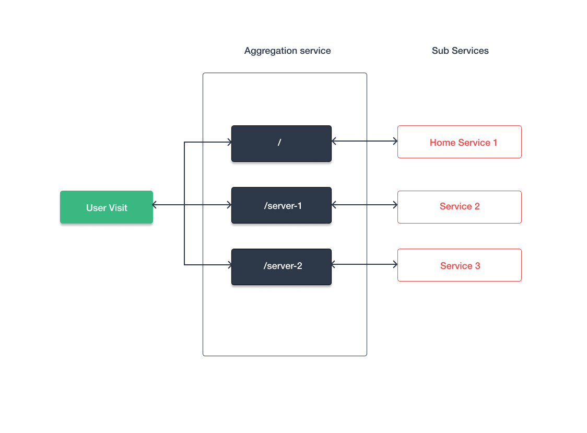

# Microarchitecture
As the application scale grows larger and larger, packaging all the functions of all business modules into one project will cause the packaging speed to become slower and slower, and if multiple teams maintain it, conflicts will easily occur. So we need to split it into different services and break down business modules. The following will use [Followme5.0](https://www.followme.com/?source=genesis) layout to take you to realize a micro frontend, micro service architecture.

## Architecture diagram

- From the frontend layout, it is divided into left navigation and right content area, which is a typical left and right layout.
- From the perspective of service architecture, it is divided into aggregation services and sub-services. All requests will go to aggregation services and request corresponding sub-services according to different url addresses

## Provide service rendering interface
```ts
    const renderModes = ['ssr-html', 'ssr-json', 'csr-html', 'csr-json'];
    /**
     * Provide an API to allow external rendering
     */
    app.use('/api/render', (req, res, next) => {
        // Get the rendered address

        const url = decodeURIComponent(String(req.query.renderUrl));
        // Get the route rendering mode
        const routerMode =
            ['abstract', 'history'].indexOf(String(req.query.routerMode)) > -1
                ? req.query.routerMode
                : 'history';
        // Rendered mode
        const mode: any =
            renderModes.indexOf(String(req.query.renderMode)) > -1
                ? String(req.query.renderMode)
                : 'ssr-json';

        renderer
            .render({
                url,
                mode,
                state: {
                    routerMode
                }
            })
            .then((r) => {
                res.send(r.data);
            })
            .catch(next);
    });
```
The above received a total of three parameters, rendering address, rendering mode and routing mode, it will provide a common rendering outlet to facilitate other service calls.

## Remote component call
```vue
<template>
    <div>
        <remote-view
            v-for="name in names"
            v-show="ssrname === name"
            :key="name"
            :clientFetch="() => clientFetch(name)"
            :serverFetch="() => serverFetch(name)"
        ></remote-view>
    </div>
</template>
<script lang="ts">
import Vue from 'vue';
import { RemoteView } from '@fmfe/genesis-remote';
import axios from 'axios';

interface Data {
    names: string[];
}
interface Methods {
    clientFetch: (ssrname: string) => Promise<void>;
    serverFetch: (ssrname: string) => Promise<void>;
}
interface Computed {
    ssrname: string;
}

export default Vue.extend<Data, Methods, Computed>({
    name: 'container',
    components: {
        RemoteView
    },
    data() {
        return {
            names: []
        };
    },
    computed: {
        ssrname() {
            return this.$route.meta.ssrname;
        }
    },
    watch: {
        ssrname() {
            if (this.names.indexOf(this.ssrname) > -1) return;
            this.names.push(this.ssrname);
        }
    },
    created() {
        this.names.push(this.ssrname);
    },
    methods: {
        /**
         * When the client calls remotely, CSR rendering
         */
        async clientFetch(ssrname: string) {
            const renderUrl = encodeURIComponent(this.$route.fullPath);
            const res = await axios.get(
                `http://localhost:3000/api/${ssrname}/render`,
                {
                    params: {
                        routerMode: 'history',
                        renderMode: 'csr-json',
                        renderUrl
                    }
                }
            );
            if (res.status === 200) {
                return res.data;
            }
            return null;
        },
        /**
         * When the server is called remotely, SSR rendering
         */
        async serverFetch(ssrname: string) {
            const renderUrl = encodeURIComponent(this.$route.fullPath);
            const res = await axios.get(
                `http://localhost:3000/api/${ssrname}/render`,
                {
                    params: {
                        routerMode: 'history',
                        renderMode: 'ssr-json',
                        renderUrl
                    }
                }
            );
            if (res.status === 200) {
                return res.data;
            }
            return null;
        }
    }
});
</script>

```
- When the user accesses the first screen, we prefetch data remotely on the server side, and take SSR rendering, which is also conducive to SEO
- CSR rendering is used when the client calls remotely, which can reduce the pressure on the server
- In order to prevent users from accessing the same service, they need to re-request each time, so an array is defined, all the accessed services are stored in an array, and only the services accessed by the current user are displayed, and other services are hidden

For more in-depth understanding of remote components, please click [here](../remote)


## Page multiple routing example
The micro front-end architecture is used, which means that each service has its own routing. In order to ensure routing synchronization, we provide a library that wraps vue-router. You need to create a route from this library. Click [here](../app) Learn more

## Externalization dependency
With more and more services, you may not want to package the vue library once for each service. You may want to externalize some dependencies, [click here to learn](../core/#hookdescription)

## Complete example
Because of the limited space for writing documents, we have written a complete micro frontend & micro service demo. You can use this demo for a more in-depth understanding.
- [vue-genesis-micro](https://github.com/fmfe/vue-genesis-micro)